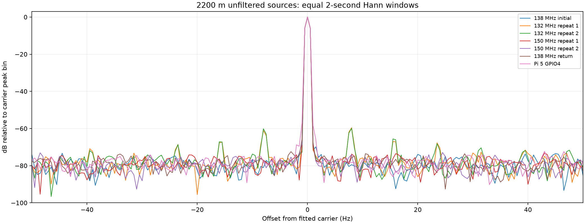
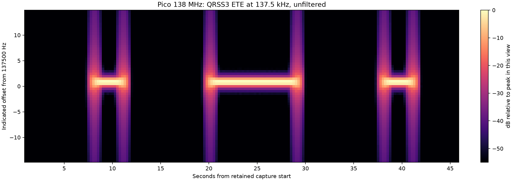
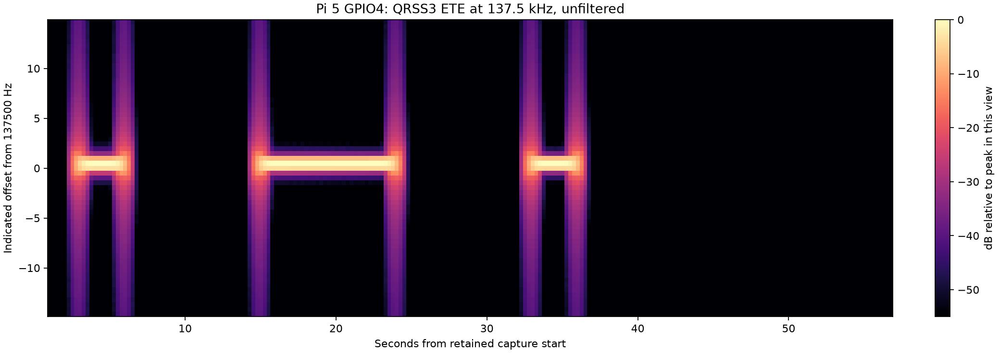

# Focused 2200 m investigation

Status: complete, with final hardware inactivity verified. This follows the full campaign and
preserves its original results. The operator requested a focused 137.5 kHz
investigation, clock comparisons, unfiltered Pi comparison, documented quality
criteria and three-second QRSS dots. This supersedes the earlier instruction to
skip 2200 m retesting for the completed full sweep.

## Setup and interpretation

Pico GP2, Leo Bodnar Output 1 and the selected wspr5 GPIO4 comparison output each
use operator-confirmed 60 dB attenuation into the SDR combiner. No external RF
filter is present. Sources are enabled sequentially. Narrowband SDR observations
compare close-in quality and visual/decoder usability; they do not measure total
harmonic power or establish filtered transmitter emissions compliance.

The Pico comparison uses the existing 132, 138 and 150 MHz system/PIO profiles,
with separate verified firmware files. The frequency axis remains indicated;
sequential GPSDO observations are diagnostics rather than a frozen calibration.
Changing a clock profile does not prove a correction to the crystal's ppm error.

## Published criteria and how they are applied

| Topic | Documented basis | Application in this investigation |
|---|---|---|
| QRSS3 | Spectrum Lab's author describes three-second dots as common on LF. | Transmit three-second dots and inspect retained-IQ waterfalls for readable Morse. |
| Morse proportions | ITU-R M.1677-1 specifies dash/dot and spacing ratios of 3, 1, 3 and 7. | Report dot/dash durations and correct character spacing as ratios; millisecond differences remain diagnostics. |
| Slow shifted modes | QRP Labs documents seconds-long elements and recommends 4–5 Hz shift. | Use 5 Hz separation and report whether the two tracks are distinct and stable on the waterfall. |
| DFCW convention | QRP Labs describes equal-duration dot/dash elements, but its shift polarity differs from this project's reviewed profile. | Label the project's high-dot/low-dash profile explicitly; do not call it universal DFCW conformance. |
| WSPR waveform | Joe Taylor's guide specifies continuous-phase four-tone FSK, 1.4648 Hz spacing, approximately 6 Hz bandwidth and 110.6-second frames. | Independently decode three consecutive frames and measure spacing, drift and spectrum. |
| WSPR operating stability | The guide recommends UTC accuracy about one second and correcting drift beyond about 1 Hz/minute when possible. | Compare measured drift with that guidance. Burst-aligned decoding does not independently establish absolute UTC accuracy. |

Sources read on 2026-09-07:

- [Spectrum Lab QRSS quick start](https://www.qsl.net/dl4yhf/speclab/qrss_quickstart.htm).
- [ITU-R M.1677-1, Annex 1 section 2](https://www.itu.int/dms_pubrec/itu-r/rec/m/R-REC-M.1677-1-200910-I!!PDF-E.pdf).
- [QRP Labs Ultimate3S operation manual v3.10, sections 2 and 3](https://www.qrp-labs.com/images/ultimate3s/operation3.10.pdf).
- [Joe Taylor, WSPR 2.0 User's Guide, pages 4–5 and Appendix B; retained public mirror](https://www.9h1cl.com/docs/WSPR_2.0_User.pdf).

These sources do not provide a universal QRSS phase-fit-RMS or millisecond-edge
acceptance limit. The previous campaign's 0.15 Hz transition-fit and 20 ms keyed
edge limits are engineering diagnostics, not published QRSS usability standards.
This investigation keeps their results visible but assesses visual copy and
protocol semantics separately. A successful strong-signal decode also does not
prove weak-signal sensitivity or a clean transmitted spectrum.

## Evidence

New artifacts are retained under `build/2200m-cleanup-20260907/`. Two initial
preflight attempts enabled no Pico RF: one detected GPSDO outputs enabled at
10 MHz, and the next found the former temporary capture helper absent. Cleanup
verified source inactivity. The helper was rebuilt from the existing wspr5
Harness checkout into `/var/tmp/wsprrypico-2200-capture-build`; both native checks
passed. Original failed attempts and old campaign captures are unchanged.

## Fresh 138 MHz result

The complete `full-138-qrss3` bundle contains thirteen completed WTP transactions:
one TONE, three consecutive independently decoded WSPR frames, and three ETE
jobs each for QRSS, FSKCW and DFCW. All five matrix rows qualified under the
unchanged strict operational checks, and final cleanup verified. The artifact
validator independently confirmed the five-row scope and transaction evidence.

| Mode | Repetitions | Result | Relevant observation |
|---|---:|---|---|
| TONE | 1 | Qualified | 5.000 s uninterrupted; indicated offset +0.826 Hz; short-segment variation 0.00272 Hz peak to peak. |
| WSPR | 3 consecutive | Qualified | All decoded AA0NT EM18 37; each measured 110.592 s. Tone spacing 1.467195–1.467224 Hz; maximum symbol residual 0.01478 Hz. |
| QRSS3 | 3 | Qualified | Readable ETE: approximately 3/9/3 s marks with 9 s character gaps and final silence. |
| FSKCW3 | 3 | Qualified | Distinct stable mark/space tracks; measured shift 5.01275–5.01288 Hz. |
| DFCW3 | 3 | Qualified | Equal three-second dot/dash elements; high/low/high ETE pattern and silent gaps. |

The WSPR fitted drift ranged from −0.00741 to −0.00162 Hz/minute, well within
Joe Taylor's approximately 1 Hz/minute correction guidance. This is the
transmitter-plus-receiver indicated drift; it is not a calibrated crystal
measurement. Waterfalls use unchanged original IQ, 2.048-second Hann windows,
0.488 Hz frequency bins and 0.25-second display hops. No noise spikes are removed.
Windowing broadens the displayed edges; the timing assessment uses IQ samples.

The old 2200 m failure is not reproduced. The old TONE capture contained two
one-millisecond detector gaps, and an old keyed capture aligned to a one-millisecond
noise event before the actual burst. That alignment can contaminate all subsequent
frequency and timing diagnostics. The old failures remain recorded; this later
pass does not establish why the earlier receiver/Pico session differed. The
138 MHz clock and firmware RF implementation were not changed to obtain this
pass. The recorded C/C++/PIO source hashes match the original sweep, and the rebuilt
receiver helper is byte-identical to the former helper. The new firmware file
has a different build identity. The keyed workload was deliberately lengthened
to QRSS3. No controlled intervention isolates the cause of the earlier failure.

## wspr5 reboot recovery observation

Before the comparator could run, the installed RP1 provider retained coherent
GPIO4 route journals from boot `36835b95-e304-4dc0-9b1f-54653d506c3f`, while the
current boot was `15a6a862-f574-4042-bde3-bc439bc5f4fc`. No active provider endpoint
was present. Route planning refused activation and required recovery. The four
original journals were archived before using the installed provider's supported
post-reboot retirement operation. Its owned application inhibitor was restored,
then reviewed neutral activation and GPIO4 route activation succeeded with
output disabled. The application returned active and idle.

This is a reboot-recovery defect in the installed setup, separate from RF
performance. Ordinary reboot should leave output off and allow route recovery
without manual repair. The installed provider source was not changed, and the
recovery steps here are not a permanent fix or a reboot regression test. The
archive and complete plans/results are retained with the investigation.

## Clock comparison

Two independent five-second tone screens passed at 132 MHz, two at 150 MHz,
and a final return-control screen passed at 138 MHz. Each had verified source
and receiver cleanup. The following comparison uses the same two-second Hann
windows (0.5 Hz bins), averaging two on windows and retaining a leading off
window. It searches 2–50 Hz from the fitted carrier; it is a relative diagnostic,
not a published spectral mask or an integrated-power measurement.

| Clock | Strongest nearby bin, dBc | Offset from carrier | Interpretation |
|---|---:|---:|---|
| 138 MHz, initial | −73.36 | −44.5 Hz | Clean close-in baseline. |
| 132 MHz, repeat 1 | −59.57 | +8.0 Hz | Reproducible nearby alias. |
| 132 MHz, repeat 2 | −59.90 | +8.0 Hz | Confirms the first observation. |
| 150 MHz, repeat 1 | −73.19 | +43.0 Hz | Comparable to the 138 MHz baseline. |
| 150 MHz, repeat 2 | −72.90 | +24.5 Hz | No demonstrated close-in improvement. |
| 138 MHz, return | −72.45 | −3.0 Hz | Return control remains comparable. |

The finite sampled-square-wave calculation predicted individual 132 MHz aliases
near ±7.868 Hz at about −59.64 dBc, consistent with the measured +8 Hz bin.
This calculation is not a bound on all analog or aggregated spectral products.
The 132 MHz component is roughly 13 dB stronger than the largest nearby bin in
the 138 MHz captures. The practical choice for this pass remains 138 MHz:
150 MHz has not demonstrated an improvement, and 138 MHz has the complete
five-mode evidence. No 12 MHz system-clock experiment was needed or performed.

| 2200 m clock | TONE | WSPR | QRSS3 | FSKCW3 | DFCW3 |
|---|---|---|---|---|---|
| 132 MHz | Qualified (2/2) | Blocked: not run | Blocked: not run | Blocked: not run | Blocked: not run |
| 138 MHz | Qualified | Qualified (3/3) | Qualified (3/3) | Qualified (3/3) | Qualified (3/3) |
| 150 MHz | Qualified (2/2) | Blocked: not run | Blocked: not run | Blocked: not run | Blocked: not run |

Clock-screen bundles intentionally remain incomplete five-mode campaigns.
Their TONE evidence does not qualify another mode. Absolute indicated offsets
include receiver error and session drift, so these comparisons do not fit a
crystal slope/intercept correction.

## Unfiltered Pi comparison

wspr5 GPIO4 completed a bounded 12-second 137.5 kHz tone and a complete QRSS3
ETE transmission. The tone stopped through SIGINT at its explicit deadline;
its timeout status 124 is expected, and the application log, provider idle
state and receiver evidence confirmed cleanup. The successful QRSS invocation
completed on its own with exit status zero. Both operations restored the
previously active, idle WsprryPi service.

| Comparable observation | Pico 138 MHz | Pi 5 GPIO4 |
|---|---:|---:|
| Strongest 2–50 Hz tone bin | −73.36 dBc initial; −72.45 dBc return | −68.78 dBc |
| Four-second tone phase-fit RMS | 0.00374 rad initial | 0.01501 rad |
| QRSS ETE measured marks | 3.001 / 9.001 / 3.001 s | 3.001 / 9.004 / 3.002 s |
| QRSS visual copying | Readable ETE | Readable ETE |
| Same strict keyed checks | 3/3 passed | 1/1 passed |

The measured durations preserve the meaningful 1:3 Morse proportions. The
small millisecond differences do not compromise QRSS3 visual copying. The
Pico's close-in tone result is at least comparable in these captures; one Pi
tone does not establish a general performance ranking across units or bands.
Pi WSPR, FSKCW and DFCW were not tested in this focused comparator. These two
captures are a benchmark, not a complete Pi five-mode qualification campaign.

The first Pi QRSS attempt (`pi-qrss3`) loaded `--mode QRSS --cw-*` settings but
reported no transmission requested. It emitted no intended RF and is retained
as a blocked comparator attempt, not a signal-quality failure. The documented
`--qrss-message ETE --qrss-frequency 137500 --qrss-dot-seconds 3` transient
startup form produced the successful `pi-qrss3-startup` capture. No Pi source
was modified to obtain these measurements.

## Build and path identities

- Pico 2 W / RP2350 A2, chip serial `0BF4B4AEC9FFB344`, WTP device
  `fd6127d11d6aca42a9905fa3fb1bf1d5`, GP2 PIO/DMA, zero requested frequency correction.
- Firmware source baseline `40812e7438f180c5e8d8ad75d4eb227271152b10`, embedded
  revision `40812e7438f1-dirty`; existing RF source with build-selected clocks.
  Pico SDK 2.3.0 and Arm toolchain 15.3.1. The campaign records executing source
  hashes separately from the firmware file and reported clock identity.
- 132 MHz UF2 SHA-256:
  `7998b8f089848714fe05004adb579976b7394027f26e6a94fe9d9d0c94d0d80b`.
- 138 MHz UF2 SHA-256:
  `b04a7b9c40c12a3c74823b29ec0c7f717e1611da6c0b1e1fba219b9f52149ee3`.
- 150 MHz UF2 SHA-256:
  `310fd428e2cfda3d330a589ea8f85b802d4d97e4f742493fb41d42fc5c24c04e`.
- Local Harness `86ab5772a65e20cd4ccd6e2f38f8bf6c37bfc9f3`; wspr5 native capture
  source `d69da41a4d5ae14fc6a451889e153c2aaf48ce09`, clean before its rebuild.
  Capture helper SHA-256
  `b98de116d696846b88eea1b3ad3f1b2a471052fa2ca440f4234fec7087dc5a03`.
- RSP1B `2404058C60`: 250 ksample/s CF32, 200 kHz bandwidth, 112.5 kHz center,
  20 dB gain, AGC and bias tee off. Retained metadata checks exact settings,
  sample count, identity, zero clipping/overflow and receiver cleanup.
- Leo Bodnar `0673ED0FA107`, Output 1, library SHA-256
  `97ca1f8c6737c19901edc853848eea5a39a3d8dc3d1a8c387f1ecc45cea3cff2`.
  Reference captures require satellite/PLL lock and verified output selection.
- Pi comparator: wspr5 Raspberry Pi 5 Model B Rev 1.0, kernel
  `6.18.34+rpt-rpi-2712`, WsprryPi `3.2.0-devel+15a0348`, executable SHA-256
  `c4206ab536e2a4fd1da8e4171f43f2ca114ef4f88ba2facd1bb98db237ce4617`.
  RP1 provider source `33244c90ab6434959fbd1b37d3573881bcce735d`, GPIO4, 2 mA
  requested drive; binding SHA-256
  `13424b20e82a950609ee28b462fb0b1558c2d558fe7a564528ff475b92fddaa9`.

The three attenuated branches are operator-reported physical connections, not
measured attenuator transfer functions. No result transfers to another GPIO,
clock, image, RF route, band frequency or receiver configuration.

## Retained diagnostic figures

The 132 MHz traces have repeatable nearby products. Values are normalized to
each source's carrier, with no claim of equal RF power. The larger plot range
includes the bins reported in the comparison table.

The Pico's three-second dots and nine-second dash are readily distinguishable.
Frequency broadening at the edges includes the waterfall window response.

The Pi display uses the same frequency resolution and color range as the Pico
view; each is normalized to its own peak. The horizontal axes retain their
respective capture start times and durations.

## Review, validation and final state

Adversarial review round one addressed four risks: default-plan identity drift,
accepting a plan with the wrong live clock, mistaking a silent Pi command for
an RF comparison, and attributing the fresh pass to an unisolated repair.
A fixed legacy digest regression check and live-clock mismatch test now cover
the first two; the silent attempt remains separate from the successful transient
command; and the report explicitly limits causal conclusions.

Round two checked the resulting diff, canonical validation, exact recorded
source manifests, complete versus screen-only claims, RF/capture shutdown,
figure interpretation and source attribution. No actionable finding remains in
the changed campaign slice. The installed RP1 reboot-recovery defect and the
Pi general-mode CLI startup behavior are retained as separate follow-up issues;
neither was permanently repaired by this investigation.

Validation completed:

- All 23 Pico host CTest targets passed, including campaign IQ fault checks.
- Six planner, five adapter and nine artifact-evidence tests passed; the final
  planner rerun includes the fixed original-plan digest assertion.
- WTP/1 schema/raw/framing/transition contract checks passed.
- Pinned firmware builds passed at 132, 138 and 150 MHz; restoring the default
  138 MHz build reproduced the tested UF2 hash exactly.
- All six retained full/clock-screen campaign bundles passed artifact and scope
  validation. Every executing source manifest matches the retained source archive.
- Changed Python files passed Ruff formatting and fatal-error lint checks;
  documentation links and Git whitespace checks passed. The inherited broader
  Ruff policy also reports existing style findings in these campaign files;
  this is not a claim of a clean repository-wide Ruff run.

The Pico was returned to the preserved standard inhibited UF2, SHA-256
`30ec34dad612f6243f0f6abd15284868cb92b672946cb2785317fabc8d5c505d`.
INFO, HELLO, CAPS and STATUS agree on the board and boot; engine is
`inhibited-standalone-simulator`, state is empty and output is inactive.
GPSDO Output 1, Output 2 and PPS are all off. wspr5's provider reports GPIO4
idle with output disabled; pinctrl reports GPIO4 input/low, and WsprryPi service
is active. The recovered GPIO4 route is retained in valid current-boot state;
archived stale journals were not reinstalled. No manual cable reset was needed
during this investigation.

Raw captures, failed attempts, receiver metadata, full decoder/transmitter logs,
reference observations, flashed images, experiment scripts and source archive
remain outside Git under `build/2200m-cleanup-20260907/`. The committed figures
are derived diagnostic plots. The prior full-band campaign remains unchanged.

Evidence anchors (SHA-256):

- Investigation integrity index, 530 files:
  `42c31b5256df388f163bd7c02487c3071fc84f0772264d797de9b86b1f3f723f`.
- Matching campaign source archive:
  `adf4412c773ce86fde10a5f7aa77be8b41baf0f1552ffc2d32506d05cbf966eb`.
- Full 138 MHz result:
  `625f441a169764b671efa944ae3959cc8874dac7555e2dad189b2cee0d152ee8`.
- Final Pico inhibition evidence:
  `1f30632cc108bd2ed7e2534da09e55c05692e089507b2befb6964e9e84393b07`.
- Final Pi idle evidence:
  `8ebb03ce2ca4207b6bf816620bcec558cd2e90a01c39a886aff0636ef6fc7376`.
- Final GPSDO-off evidence:
  `adfc2723636b14c4d14a01e248578c381666595ab65e9c24b1e3902a222f9484`.
